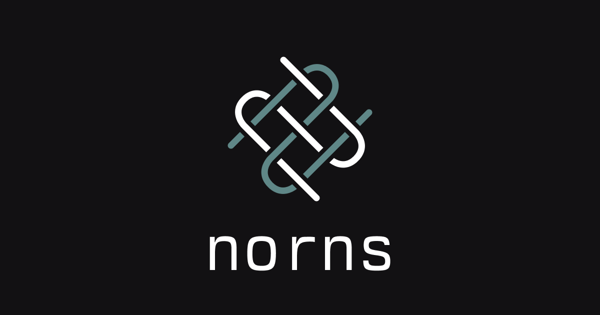

# Norns



Interoperable web components for decentralized applications

## Overview and Reasoning

Some of the first crypto apps we build were in React, and it's possible we might be able to resurrect some of them if we tried. However the unfortunate reality is that web dev frameworks accelerate at an alarming rate, and that goes for blockchain related libraries as well (shudders at the memory of viem v1 -> v2 and ethers v5 -> v6). It doesn't have to be like that though.

Web components are independant pieces of Javascript that can be imported to plain HTML but also frameworks as well. They're atomic, existing on their own and able to out-last any framework as long as we keep using Javscript (unfortunately I think that is the case). Some notable existing web component libraries include [Material Web](https://github.com/material-components/material-web) and [Web Awesome](https://github.com/shoelace-style/webawesome).

The goal of Norns is to provide the Ethereum ecosystem a set of simple yet powerful web components for building decentralized applications. The advantage we have today is that we've experienced good DX from modern frameworks, so we have the ability to build components that feel familiar to devs building UIs for smart contracts. We will start small but slowly grow the offering as we get a better feel for what devs need; check out the [Roadmap](#roadmap) for more information.

## Local Development Setup

1. Clone and install dependencies with [Bun](https://bun.sh)

```bash
git clone https://github.com/stevedylandev/norns
cd norns
bun install
```

2. Run the dev server

```bash
bun dev
```

This will run a simple server for `site/index.html` which imports components from `src/component/`

3. Build

After editing components and testing them in the dev server you can run the `build` command to generate the CLI from `src/index.ts` that will create a `dist` folder. This enables users to run something like `npx norns-ui@latest init` to setup a project and add components, similar to shadcn/ui.

## Roadmap

Still figuring this out, suggestions and examples welcome!

**CLI**

- [x] Implement `norns.json` initialization
- [x] Improve styles and UX of commands and help menus
- [ ] Include utility files like types in initialization and `norns.json`

**Components**

- [x] Connect Wallet
- [x] Contract Call
- [ ] TX Toasts?
- [ ] Contract State (similar to contract call but auto loads the state)
- [ ] Framework compatability
  - [x] React
  - [ ] Svelte
  - [ ] Vue
- [ ] General types through JSDoc?
- [ ] Add tailwindcss class/className prop
- [ ] Styles override if shadcn present?

## Contributing

Norns is still in early development but definitely open to contributions! Just open an issue to get the ball rolling :)

## Contact

Feel free to reach out to any of my [socials](https://stevedylan.dev/links) or [shoot me an email](mailto:contact@stevedylan.dev)
